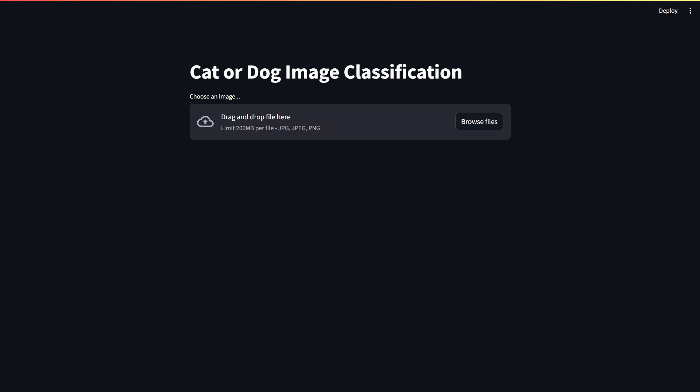
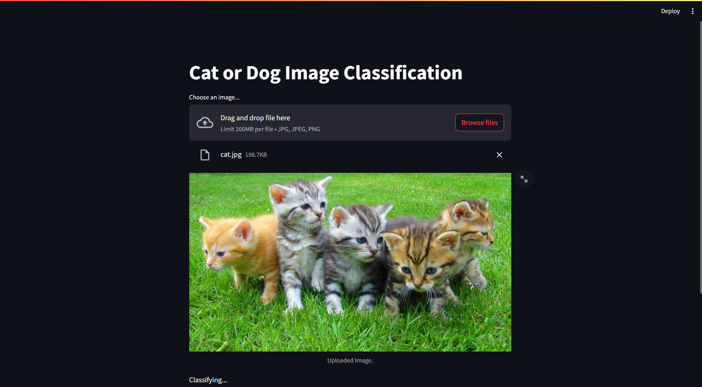
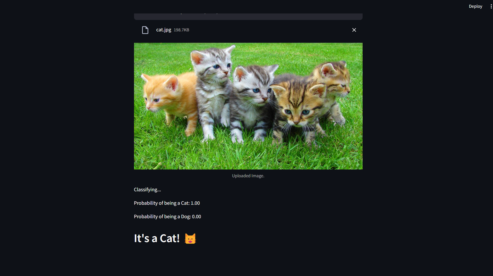

# Cat-Dog Classifier with InceptionResNetV2 and Streamlit
## Overview:
The Cat-Dog Classifier is now equipped with a sleek frontend using Streamlit, making it even more accessible and interactive. Powered by the advanced InceptionResNetV2 model, this project allows users to effortlessly identify whether a given image features a cat or a dog. Ideal for both beginners and enthusiasts, it brings the excitement of pet recognition to your fingertips.

## How it Works:

#### InceptionResNetV2 Magic: 
At the heart of our system is InceptionResNetV2, a cutting-edge model adept at recognizing intricate patterns in images. Its pre-trained capabilities enhance the accuracy of pet identification.
#### Streamlit Frontend:
We've integrated Streamlit to create a user-friendly interface. Simply upload an image, and the model instantly reveals whether it's a cat or a dog. No coding required!
Matplotlib Insights: Visualize model performance with Matplotlib directly in the Streamlit app for a comprehensive overview.
Dataset:

#### This project uses the "Dogs and Cats" dataset obtained from Kaggle. You can find the dataset here.

### Getting Started:

Curate Your Collection: Assemble a diverse set of cat and dog pictures. The more, the merrier!
Install Dependencies: Execute pip install -r requirements.txt to set up the required components.
Initiate Training: Train the model with your curated images using the train.py script.
Streamlit Deployment: Run the Streamlit app with streamlit run app.py to launch the frontend. Visit http://localhost:8501 in your browser to interact with the classifier.
Example:

```bash
  streamlit run app.py
```
#### Customization Options:

Adjust the model parameters in train.py for fine-tuning.
Modify the Streamlit app in app.py to enhance the user interface.
Dive In and Customize!
Feel free to explore, experiment, and customize to suit your preferences. Enjoy the seamless experience of recognizing your beloved furry companions with the Cat-Dog Classifier and Streamlit! 🐾


## Run Locally

Clone the project

```bash
  git clone https://github.com/abhiram4580/Cat_and_Dog_Classifier.git 
```

Go to the project directory

```bash
  cd my-project
```


```bash
  pip install -r requirements.txt
```

Start the server

```bash
  streamlit run app.py
```


## Screenshots

## Screenshot
- 
-
-


